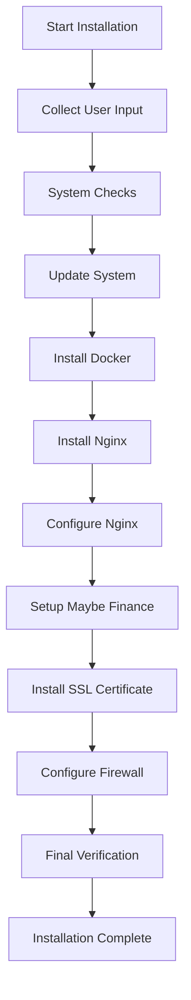

# Maybe Finance Complete Installation Guide

🚀 **One-click deployment of Maybe Finance on Ubuntu 24.04 with Docker, Nginx, and SSL**

## 🎯 Overview

This repository provides a complete, automated installation script for [Maybe Finance](https://github.com/maybe-finance/maybe) - the open-source personal finance application. The script handles everything from Docker installation to SSL certificate setup, giving you a production-ready deployment in minutes.

### What is Maybe Finance?

Maybe Finance is a powerful, open-source personal finance application that helps you:
- Track and manage your finances
- Visualize your financial data with charts
- Connect multiple accounts and institutions
- Organize spending with categories and rules
- Monitor your financial health over time

## ✨ Features

### 🔧 **Complete Automation**
- ✅ Docker & Docker Compose installation
- ✅ Nginx reverse proxy configuration
- ✅ SSL certificate (Let's Encrypt) setup
- ✅ PostgreSQL database configuration
- ✅ Redis cache setup
- ✅ UFW firewall configuration
- ✅ Security hardening

### 🔒 **Security First**
- ✅ Automatic strong password generation
- ✅ SSL/TLS encryption
- ✅ Security headers configuration
- ✅ Localhost-only Docker binding
- ✅ Firewall protection
- ✅ Non-root container execution

### 🎛️ **Production Ready**
- ✅ Domain-based access
- ✅ Automatic SSL renewal
- ✅ Gzip compression
- ✅ Health checks
- ✅ Container restart policies
- ✅ Logging and monitoring


## 🚀 Quick Start

### 1. Download the Installation Script

```bash
wget -O install.sh https://raw.githubusercontent.com/cpuix/maybe-one-click-install/main/install.sh
```

### 2. Make Script Executable

```bash
chmod +x install.sh
```

### 3. Run Installation

```bash
./install.sh
```

### 4. Follow Interactive Setup

The script will prompt you for:
- **Domain name** (e.g., maybe.yourdomain.com)
- **Email address** (for SSL certificate)
- **Database credentials** (or auto-generate)
- **OpenAI API key** (optional, for AI features)
- **Installation preferences**

### 5. Access Your Application

After installation completes:
- Visit `https://yourdomain.com`
- Create your first account
- Start managing your finances!

## 📊 Installation Process

The script performs these steps automatically:




## ⚙️ Configuration

### Environment Variables

The script creates a `.env` file with these key variables:

```env
# Security
SECRET_KEY_BASE=auto_generated_secure_key

# Database
POSTGRES_USER=maybe_user
POSTGRES_PASSWORD=auto_generated_password
POSTGRES_DB=maybe_production

# Domain
DOMAIN_NAME=your-domain.com
ACME_EMAIL=your-email@example.com

# Optional Features
OPENAI_ACCESS_TOKEN=your_openai_key
```

### Directory Structure

After installation:

```
~/docker-apps/maybe/
├── compose.yml          # Docker Compose configuration
├── .env                # Environment variables
└── volumes/            # Persistent data
    ├── postgres-data/  # Database files
    ├── redis-data/     # Cache files
    └── app-storage/    # Application files
```

### Nginx Configuration

```nginx
# Location: /etc/nginx/sites-available/your-domain.com
server {
    listen 80;
    listen 443 ssl http2;
    server_name your-domain.com;
    
    # SSL Configuration (auto-generated by Certbot)
    ssl_certificate /etc/letsencrypt/live/your-domain.com/fullchain.pem;
    ssl_certificate_key /etc/letsencrypt/live/your-domain.com/privkey.pem;
    
    # Proxy to Maybe Finance
    location / {
        proxy_pass http://localhost:3000;
        # ... additional proxy settings
    }
}
```

---

**Made with ❤️ for the open-source community**
